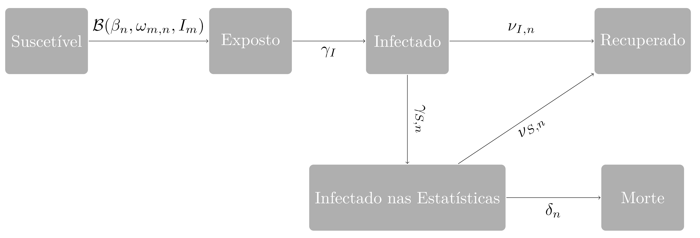

```{r setup, include=FALSE}
library(lubridate)
param <- readRDS("param.rds")
nmodels <- readRDS("nmodels.rds")
drs <- readRDS("drs.rds")
cases_city <- readRDS("cases_city.rds")
dmin <- min(ymd(cases_city$Date))
dmax <- dmin+30
```

<center> <h1> <span style='color: #1E90FF'> <strong> Modelo SEIR Metapopulacional com Mobilidade </span> </strong></h1> </center>

<br>

<h3 align='justify'> As projeções foram realizadas através da simulação de `r nmodels` Modelos SEIR Metapopulacionais, em que a mobilidade entre as cidades do Estado, mensurada por dados anônimos de geolocalização de celulares, é acoplada à um modelo epidemiológico de compartimentos. Os modelos foram escolhidos dentre dezenas de milhares de modelos candidatos, pois se aderiram bem aos dados observados. A aderência foi mensurada pela diferença entre o número de mortes e o número de casos confirmados nos Departamentos Regionais de Saúde (DRS) e Municípios com mais de $100$ mortes e $500$ casos confirmados ao final do período de uma semana terminando em `r format(dmin,"%d/%m/%Y")`.

As projeções desses modelos, que leva em consideração a transmissão do vírus entre as cidades, só pode ser realizada com maior confiança pelo período de um mês e supõe que a evolução da doença se manterá da mesma forma que na semana terminando em `r format(dmin,"%d/%m/%Y")`. Além disso, também podemos estimar através deles quando será o pico de mortes pela doença (dia com mais mortes). 

Os dados utilizados aqui foram obtidos do site da <a href='https://www.seade.gov.br/coronavirus/'>Fundação SEADE</a></h3>

<h2> <span style='color: #1E90FF'> <strong> Diferenciais </span> </strong></h2>

<h3 align='justify'> 

* <strong><span style='color: #1E90FF'>As estimativas das curvas epidemiológicas dos Municípios são realizadas de forma conjunta</span></strong>
* <strong><span style='color: #1E90FF'>A mobilidade entre as cidades é levada em consideração, de forma a identificar possíveis casos oriundos de outro Município</span></strong>
* <strong><span style='color: #1E90FF'>O R efetivo calculado considera também a incidência de infecções oriundas de outro Município de forma a identificar localidades com um aumento no número de casos devido à infecção externa</span></strong>
* <strong><span style='color: #1E90FF'>Como vários modelos são simulados, todos aqueles que se aderem aos dados, conseguimos observar de forma robusta como a doença irá se espalhar pelo Estado, identificando melhores e piores cenários, e estimando quando será o pico da doença em cada localidade</span></strong>
</h3>

<h2> <span style='color: #1E90FF'> <strong> Modelo SEIR Metapopulacional</span> </strong></h2>

<h3 align='justify'> A fim de modelar o espalhamento espaço-temporal da COVID-19 entre os Municípios do Estado de São Paulo consideramos um Modelo SEIR (Suscetíveis-Expostos-Infectados-Recuperados) com dois compartimentos extras. Após ser infectado ($I$), um indivíduo depois de um certo tempo ou será contabilizado pelas estatísticas oficiais, tornando-se Infectado nas Estatistica ($I_{s}$) e deixando de infectar outras pessoas, ou se tornará Recuperado, sem nunca ser contabilizado nas estatísticas oficiais.

O modelo assume que existe uma parcela dos infectados que podem infectar outros indivíduos, mas que nunca entrarão para as estatísticas oficiais. Também assume que, após ser diagnosticado com COVID-19, o indivíduo deixa de infectar outros, supondo que ele estará ou internado em um hospital, ou em quarentena. Um compartimento para Mortes ($D$) pela doença também é adicionado ao Modelo SEIR. Por simplicidade, consideramos que as mortes naturais e os nascimentos se cancelam, por isso não foram adicionados ao modelo.

No modelo proposto, um indivíduo Suscetível no Município $n$ se torna Exposto a uma taxa $\mathcal{B}(\beta_{n},\omega_{m,n},I_{m})$ que depende da Força de Infecção do Município ($\beta_{n}$), da proporção de indivíduos que visitaram o Município $n$ vindos de outro Município $m$ e do número de infectados ($I_{m}$) em todos os Municípios do Estado. Então, um indivíduo Exposto da se torna Infectado com uma taxa $\gamma_{I}$, e um Infectado se torna Infectado nas Estatísticas ($I_{S}$) com uma taxa $\gamma_{S,n}$, ou se torna Recuperado com uma taxa $\nu_{I,n}$. Um indivíduo Infectado nas Estatísticas ou se recupera com uma taxa $\nu_{S,n}$, ou vem a óbito com uma taxa $\delta_{n}$. Indivíduos recuperados são imunes a doença e não podem ser infectados novamente. Essa dinâmica do modelo está representada na figura abaixo.</h3>

<br>
<br>
<center><a href="https://www.ime.usp.br/"></center></a>
<br>
<br>

<h3 align='justify'> Os parâmetros do modelo estão relacionados ao tempo médio exposto da doença $\tau_{E}$, ao tempo médio infectado antes de entrar nas estatísticas oficiais $\tau_{S}$, ao tempo médio infectado até se recuperar sem entrar nas estatísticas oficiais $\tau_{I}$, ao tempo médio até se recuperar depois de ser contabilizado nas estatísticas oficiais $\tau_{SR}$, ao tempo médio até o óbito depois de ser contabilizado nas estatísticas oficiais $\tau_{D}$, e às proporções de infectados contabilizados pelas estatísticas oficiais $p_{S,n}$ e de morte dentre aqueles que entraram nas estatísticas oficiais $p_{D,n}$ no Município $n$. A relação entre os parâmetros e essas quantidades é a sequinte:
<br>

$$\begin{align*}
\gamma_{I} = \frac{1}{\tau_{E}} & & \gamma_{S,n} = \frac{p_{S,n}}{\tau_{S}} &  & \nu_{I,n} = \frac{(1-p_{S,n})}{\tau_{I}} & & \nu_{S,n} = \frac{(1-p_{D,n})}{\tau_{SR}} & & \delta_{n} = \frac{p_{D,n}}{\tau_{D}}
\end{align*}$$
<br>

Dessa forma, o modelo tem um significado biológico relacionado às propriedades da doença. Após um tempo com média $\tau_{E}$, um indivíduo exposto à doença se torna infectado e capaz de infectados outros. Então, uma proporção $1-p_{S,n}$ deles se mantém infectados por um tempo com média $\tau_{I}$ antes de se recuperar, enquanto uma proporção $p_{S,n}$ entram para as estatísticas oficiais de casos confirmados depois de um tempo com média $\tau_{S}$. Uma vez contabilizado nas estatísticas oficiais, o indivíduo deixa de infectar outros. Ainda, uma proporção $1-p_{D,n}$ deles se recupera em um tempo com média $\tau_{SR}$, enquanto uma proporção $p_{D,n}$ vem a óbito após um tempo com média $\tau_{D}$.

A dependência no Município $n$ dos parâmetros é expressada somente pela proporção de infectados contabilizados nas estatísticas oficiais no Município, e a taxa de morte entre eles, já que o tempo médio em cada compartimento é uma propriedade da doença e do seu tratamento, não do Município. Como a sub-notificação de casos causa um aumento artificial na proporção de mortes em relação aos casos confirmados, as taxas de cada Município estão relacionadas à sub-notificação de casos nele, que é expressada por $p_{S,n}$. Assumimos que a capacidade para testar não é homogênea entre os Municípios, que têm diferentes características econômicas e sociais, e por isso consideramos um valor para cada cidade. </h3>

<h2> <span style='color: #1E90FF'> <strong> Mobilidade Urbana</span> </strong></h2>

<h3 align='justify'> A mobilidade entre as cidades é levada em consideração para determinar quantos indivíduos são expostos à COVID-19 em cada Município em um dia, que são
<br>

$$ \mathcal{B}(\beta_{n},\omega_{m,n},I_{m}) = \frac{\beta_{n}(t)S_{n}(t)}{(N_{n} - D_{n}(t))}\left(\sum_{m \neq n} \omega_{m,n}(t) I_{m}(t) + I_{n}(t)\right)$$
<br>

em que $S_{n}(t)$ é o número de indivíduos sucetíveis no Município $n$ no dia $t$, $N_{n}$ é a população do Município $n$, $D_{n}(t)$ é o número de mortes confirmadas pela doença no Município $n$ até o dia $t$, $\beta_{n}(t)$ é a Força de Infecção do Município $n$ no dia $t$, $I_{m}(t)$ é o número de infectados pela doença no Município $n$ no dia $t$ e $\omega_{m,n}(t)$ é a proporção da população do Município $m$ que visitou o Município $n$ no dia $t$. 

Essa proporção é estimada através de dados georreferenciados anônimos de celular, a partir do qual se infere o número de viagens que ocorreram entre dois Municípios. Mais informações sobre como essa porporção é calculada estão disponíveis em <a href='https://www.youtube.com/watch?v=KwJbBaURZaE'>vídeo</a> e <a href='https://www.ime.usp.br/~pedrosp/wp/wordpress/wp-content/uploads/2020/04/Peixoto-et-al-COVID19-mobility-SP-RJ.pdf'>aqui</a>.
</h3>

<h2> <span style='color: #1E90FF'> <strong> Número Reprodutivo Efetivo </span> </strong></h2>

<h3 align='justify'> O <span style='color: #1E90FF'> Número Reprodutivo (R) Efetivo </span> representa o número médio de casos secundários causados por um indivíduo infectado residente no Município. No modelo proposto ele é dado por
<br>
$$R_{n}(t) = \left[p_{S,n} \tau_{S} + (1-p_{S,n}) \tau_{I}\right] \left\{\left[1+\sum_{m \neq n} \frac{I_{m}(t)}{I_{n}(t)} \omega_{m,n}(t)\right]\frac{\beta_{n}(t)S_{n}(t)}{(N_{n} - D_{n}(t))}\right\} $$
<br>

O primeiro termo da multiplicação representa o tempo médio que um indivíduo qualquer exposto à doença permanece infectado e capaz de infectar outros. O segundo termo representa quantos indivíduos em média são expostos diariamente para cada indivíduo infectado no Município. Observe que o $R$ efetivo é formado por duas partes, uma relativa à infecção por indivíduos residentes no Município e outra relativa à infecção por indivíduos provenientes de outro Município. Dessa forma, o $R$ efetivo do modelo considerado identifca cidades em uma tendência de crescimento do número de casos devido à infecções oriundas de outros Municípios.
</h3>

<h2> <span style='color: #1E90FF'> <strong> Estimação dos Parâmetros </span> </strong></h2>

<h3 align='justify'> A taxa de morte de cada município é calculada diretamente das estatísticas oficiais e a proporção da população que viaja diariamente de uma cidade para outra é estimada por dados georreferenciados de celular, enquanto a Força de Infecção é calculada explicitamente como uma formula dos outros parâmetros, que depende também das condições iniciais. Já a proporção de infectados e os tempos médios em cada compartimento são determinados baseando-se na aderência aos dados observados nos Municípios e nos Departamentos Regionais de Saúde (DRSs). Dentre $100,000$ modelos simulados com valores candidatos para os parâmetros, são escolhidos aqueles que simultaneamente:
<br>

* acertam o número de mortes com um erro máximo de 6\% em pelo menos 90\% das comparações da semana terminando em `r format(dmin,"%d/%m/%Y")`, sendo que uma comparação é formada pela combinação de um DRS com mais de $100$ mortes confirmadas e um dia.
* acertam o número de casos confirmados com um erro máximo de 7\% em pelo menos 90\% das comparações da semana terminando em `r format(dmin,"%d/%m/%Y")`, sendo que uma comparação é formada pela combinação de um DRS com mais de $500$ casos confirmados e um dia.
* acertam o número de mortes com um erro máximo de 6\% em pelo menos 90\% das comparações da semana terminando em `r format(dmin,"%d/%m/%Y")`, sendo que uma comparação é formada pela combinação de um Município com mais de $100$ mortes confirmadas e um dia.
* acertam o número de casos confirmados com um erro máximo de 7\% em pelo menos 90\% das comparações da semana terminando em `r format(dmin,"%d/%m/%Y")`, sendo que uma comparação é formada pela combinação de um Município com mais de $500$ casos confirmados e um dia.

A aderência é testada contra uma suavização da incidência de casos e mortes confirmadas em cada Município a fim de corrigir possíveis efeitos sazonais devido à heterogeneidade da realização de testes entre os dias da semana. As condições iniciais do modelo também são baseadas nessa suavização.

As estatísticas descritivas dos parâmetros dos `r nmodels` modelos considerados foram (Mediana [Mínimo;Máximo]):
<br>
<br>

* $\tau_{E}$: `r round(median(param$Te),1)` [`r round(min(param$Te),1)`;`r round(max(param$Te),1)`] dias Exposto antes de se tornar Infectado
* $\tau_{I}$: `r round(median(param$Ti),1)` [`r round(min(param$Ti),1)`;`r round(max(param$Ti),1)`] dias Infectado antes de se Recuperar sem entrar para as estatísticas
* $\tau_{S}$: `r round(median(param$Ts),1)` [`r round(min(param$Ts),1)`;`r round(max(param$Ts),1)`] dias Infectados antes de entrar para as estatísticas
* $\tau_{SR}$: `r round(median(param$Tsr),1)` [`r round(min(param$Tsr),1)`;`r round(max(param$Tsr),1)`] dias até Recuperação após entrar para as estatísticas
* $\tau_{D}$: `r round(median(param$Td),1)` [`r round(min(param$Td),1)`;`r round(max(param$Td),1)`] dias até Óbito após entrar para as estatísticas 
* $p_{S}$: `r 1-round(median(param$MedianAssymptomatic),4)` [`r 1-round(max(param$MedianAssymptomatic),4)`;`r 1-round(min(param$MedianAssymptomatic),4)`] proporção de infectados que são contabilizados nas estatísticas no Estado como um todo
<br>

<strong> Os valores estimados de casos confirmados, óbitos e pico da doença, se referem à mediana das previsões dos modelos considerados, enquanto as bandas superiores e inferiores se referem ao Mínimo e Máximo, respectivamente, das previsões dos modelos considerados. Como cada modelo representa um cenário para o futuro que se encaixa bem aos dados da semana terminando em `r format(dmin,"%d/%m/%Y")`, temos o melhor e pior cenário, além de um cenário médio. </strong>

</h3>

<h2> <span style='color: red'> <strong> DISCLAIMER </span> </strong></h2>

<h3 align='justify'> <span style='color: red'> <strong> APENAS PROJEÇÕES PARA MUNICÍPIOS EM QUE FOI TESTADA A ADERÊNCIA DOS MODELOS AOS DADOS (AQUELES COM MAIS DE 500 CASOS E 100 MORTES CONFIRMADAS EM `r format(dmin,"%d/%m/%Y")`) SÃO APRESENTADAS NESSE DASHBOARD, EMBORA O MODELO FORNEÇA PREDIÇÕES PARA TODOS OS MUNICÍPIOS DO ESTADO. AS ÚNICAS QUANTIDADES QUE DEVEM SER CONDIERADAS NESSE DASHBOARD SÃO AS PREVISÕES DE CASOS E MORTES APRESENTADAS EM LOCAL OPORTUNO ATÉ O DIA `r format(dmax,"%d/%m/%Y")` E A PREVISÃO PARA O PICO DA DOENÇA NAS LOCALIDADES APRESENTADAS. NADA ALÉM DO PICO DA DOENÇA DEVEM SER CONSIDERADO NAS FIGURAS E IMAGENS.
</h3>

<h2> <span style='color: #1E90FF'> <strong> Quem somos </span> </strong></h2>

<h4 align='left'> Diego Marcondes (<a href='mailto:dmarcondes@ime.usp.br'>dmarcondes@ime.usp.br</a>) <br>
Claúdia Peixoto (<a href='mailto:claudiap@ime.usp.br'>claudiap@ime.usp.br</a>) <br>
Sergio Oliva (<a href='mailto:smo@ime.usp.br'>smo@ime.usp.br</a>) <br>
Pedro Peixoto (<a href='mailto:ppeixoto@usp.br'>ppeixoto@usp.br</a>)</h4>
